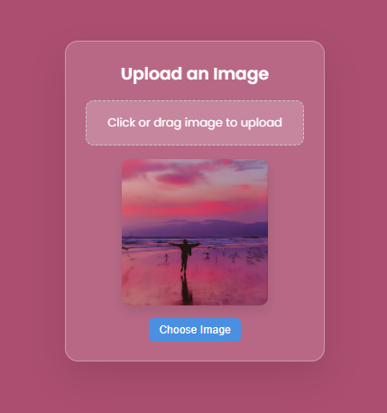

# Color Thief with Your Image

A simple and beautiful web application that allows users to upload an image and automatically changes the background color of the page based on the dominant color extracted from the image using the [Color Thief](https://lokeshdhakar.com/projects/color-thief/) library.

## Features

* Upload an image via click or drag-and-drop
* Preview the uploaded image
* Automatically extract and apply the dominant color from the image as the background
* Smooth and visually pleasing UI with glassmorphism effect

## 🖼 Preview

<div style="display: flex; gap: 15px; flex-wrap: wrap; justify-content: center; align-items: center;">
  
  
</div>

## Technologies Used

* HTML5
* CSS3 (Glassmorphism UI design)
* JavaScript (Vanilla)
* [Color Thief UMD](https://cdnjs.com/libraries/color-thief)

## Getting Started

### Prerequisites

A modern web browser (Chrome, Firefox, Edge, etc.). No installation required for basic usage.

### How to Use

1. Clone this repository or download the files.
2. Open the `index.html` file in your browser.
3. Upload an image by clicking the upload area or using the "Choose Image" button.
4. The background will change to the dominant color of the image automatically.

### File Structure

```
├── index.html        # Main HTML page
├── style.css         # Styling for the page
├── logic.js          # JavaScript logic for handling image upload and color extraction
```

## Customization

* You can customize the styles in `style.css` to match your desired theme.
* Replace the font from Google Fonts or tweak layout settings as needed.

## Libraries

* **Color Thief**: Extracts the dominant color from an image. Included via CDN:

  ```html
  <script src="https://cdnjs.cloudflare.com/ajax/libs/color-thief/2.3.2/color-thief.umd.js"></script>
  ```

## Author

Developed by [Ravi Ranjan Sharma](https://www.instagram.com/nr_snorlax/).
