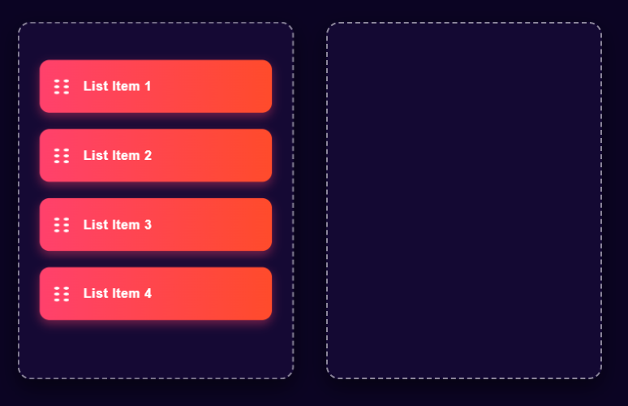
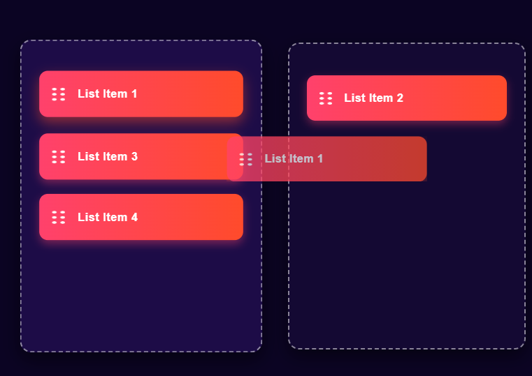

[home](/README.md)

# Drag & Drop Web App

This is a simple and visually appealing drag-and-drop web application built using HTML, CSS, and JavaScript. Users can drag items between two boxes, demonstrating the basic implementation of drag-and-drop functionality using the native HTML5 Drag and Drop API.

## Features

* **Responsive Design:** Adapts to various screen sizes.
* **Styled UI:** Clean and modern UI with gradients, hover effects, and smooth transitions.
* **Drag and Drop Support:** Easily move list items between two containers.

## 🖼 Preview 

  
  

## How It Works

* Each draggable item (`.list`) has the `draggable="true"` attribute.
* JavaScript handles `dragstart`, `dragover`, and `drop` events to move the item from one container to another.
* Hover effects and transitions enhance the user experience.

## Customization

* Change list item labels by editing the text inside the `.list` divs.
* Replace the `drag_drop_icon.png` with your own icons.
* Adjust colors and box sizes in the `<style>` section as needed.
---
Feel free to contribute enhancements or report issues!
