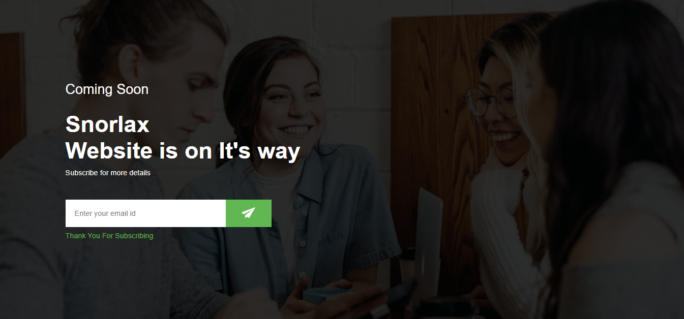

# Email Subscription Landing Page



A modern and responsive email subscription landing page with a clean design. This project features a "Coming Soon" page with an email subscription form that integrates with Google Sheets for data collection.

## Features

- Responsive design that works on all devices
- Modern and clean UI with a dark theme
- Email subscription form with validation
- Google Sheets integration for storing subscriber emails
- Animated send button with icon
- Success/error message display

## Technologies Used

- HTML5
- CSS3
- JavaScript
- Google Sheets API

## Setup

1. Clone this repository
2. Open `index.html` in your browser
3. To enable Google Sheets integration:
   - Create a new Google Sheet
   - Deploy as a web app
   - Update the form action URL in `script.js`

## Project Structure

```
Email-Subscription/
├── index.html          # Main HTML file
├── style.css          # Stylesheet
├── script.js          # JavaScript functionality
├── background.png     # Background image
└── send-icon.png      # Send button icon
```

## Usage

1. Enter your email address in the input field
2. Click the send button or press Enter
3. The form will submit the email to your connected Google Sheet
4. A success/error message will be displayed

## Customization

You can customize the project by:

- Changing the background image
- Modifying the color scheme in `style.css`
- Updating the text content in `index.html`
- Adjusting the form styling
