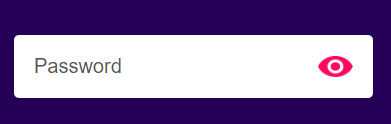
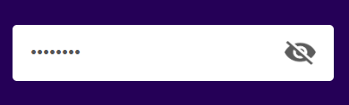

# Password Visibility Toggle

A simple and elegant password input field with a toggle feature to show/hide the password. This project demonstrates a clean implementation of password visibility control using HTML, CSS, and JavaScript.

## Preview


_Initial state with hidden password_


_Password visible state_


_Password hidden state_

## Features

- Clean and modern UI design
- Password visibility toggle with eye icon
- Responsive design that works on all screen sizes
- Smooth user interaction
- No external dependencies required

## Project Structure

```
├── index.html          # Main HTML file with embedded CSS and JavaScript
├── look/              # Directory containing icons
│   ├── eye-open.png   # Icon for visible password state
│   ├── eye-close.png  # Icon for hidden password state
│   ├── start.png      # Initial state icon
│   ├── show.png       # Show password icon
│   └── hide.png       # Hide password icon
└── README.md          # Project documentation
```

## How It Works

1. The password input field is styled with a clean white background and rounded corners
2. An eye icon is placed next to the input field
3. Clicking the eye icon toggles between:
   - Password hidden (default state)
   - Password visible (when clicked)
4. The eye icon changes to reflect the current state

## Styling Details

- Background color: #250057 (Deep purple)
- Input box: White background with rounded corners
- Font: Poppins (sans-serif)
- Responsive design with max-width of 500px
- Clean and minimal UI elements

## Browser Support

Works on all modern browsers that support:

- HTML5
- CSS3
- ES6 JavaScript