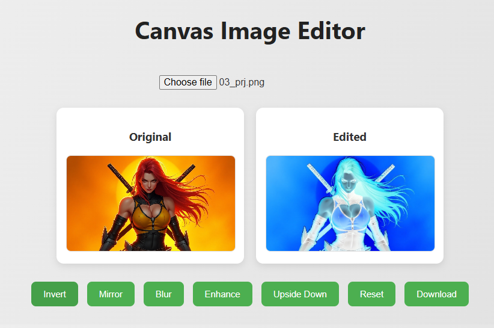
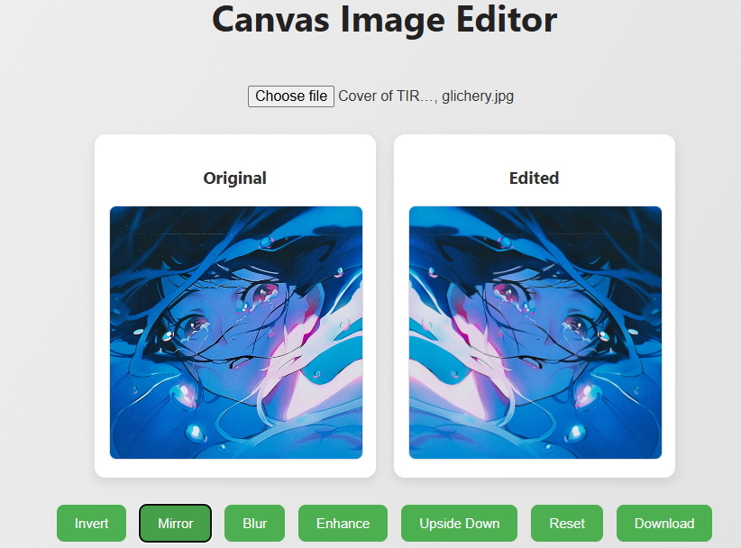

# Canvas Image Editor - README

## Overview

The **Canvas Image Editor** is a beginner-friendly, browser-based image manipulation tool built with HTML5 `<canvas>` and JavaScript. It allows users to upload an image and apply basic visual effects such as inversion, flipping, blurring, and enhancement directly in the browser.

This project is ideal for those looking to understand how raw image data can be accessed and manipulated using JavaScript.

---


## Features

* Upload an image directly from your computer.
* View the original and edited image side-by-side.
* Apply the following effects to the image:

  * **Invert Colors** (negative effect)
  * **Mirror Image** (horizontal flip)
  * **Blur**
  * **Enhance Brightness**
  * **Flip Vertically** (upside down)
  * **Reset to Original**
  * **Download the Edited Image**

---


## 🖼 Preview

<div style="display: flex; gap: 15px; flex-wrap: wrap; justify-content: center; align-items: center;">
  
  
</div>
## 🧠 Author Tips


## How to Use

1. **Open the HTML File:**

   * Save the code as an `.html` file and open it in any modern web browser (Chrome, Firefox, etc.).

2. **Upload an Image:**

   * Click the file input to upload an image. The image is displayed on two canvases: *Original* and *Edited*.

3. **Apply Effects:**

   * Use the buttons below the canvas to apply different effects. You will immediately see the changes on the Edited canvas.

4. **Download Result:**

   * Click the **Download** button to save your edited image.

---

## Deep JavaScript Logic Breakdown

### 1. **Image Upload and Initialization**

```javascript
uploadInput.addEventListener("change", function () {...});
```

* Triggered when a file is selected.
* Reads the image file using `FileReader.readAsDataURL()` which converts it into a base64 string.
* Once the image is loaded into a temporary `` object, it's drawn onto both `originalCanvas` and `canvas`.
* The original image data is stored with `getImageData()` in `originalImageData`, enabling reset functionality.

### 2. **invertImage()** - Invert RGB Values

```javascript
const imageData = ctx.getImageData(0, 0, canvas.width, canvas.height);
const data = imageData.data;
for (let i = 0; i < data.length; i += 4) {
    data[i] = 255 - data[i];       // Red
    data[i + 1] = 255 - data[i+1]; // Green
    data[i + 2] = 255 - data[i+2]; // Blue
}
ctx.putImageData(imageData, 0, 0);
```

* Retrieves all pixel data from the canvas.
* Loops through the array with increments of 4 (representing R, G, B, A).
* Each RGB component is inverted by subtracting its value from 255.
* `putImageData()` updates the canvas with the modified pixels.

### 3. **mirrorImage()** - Horizontal Flip

```javascript
const width = canvas.width;
const height = canvas.height;
const imageData = ctx.getImageData(0, 0, width, height);
const mirroredData = ctx.createImageData(width, height);

for (let y = 0; y < height; y++) {
    for (let x = 0; x < width; x++) {
        const index = (y * width + x) * 4;
        const mirrorIndex = (y * width + (width - x - 1)) * 4;
        mirroredData.data.set(imageData.data.slice(index, index + 4), mirrorIndex);
    }
}
ctx.putImageData(mirroredData, 0, 0);
```

* For each pixel, calculates its mirrored counterpart by reversing its x-coordinate.
* Uses `slice()` to copy RGBA values and `set()` to write them to the mirrored position.

### 4. **blurImage()** - Apply Blur Filter

```javascript
ctx.filter = "blur(3px)";
ctx.drawImage(canvas, 0, 0);
ctx.filter = "none";
```

* Applies a CSS blur filter to the canvas context.
* `drawImage()` redraws the current canvas content with blur.
* `ctx.filter` must be reset to prevent it from affecting other effects.

### 5. **enhanceImage()** - Brighten Pixels

```javascript
const imageData = ctx.getImageData(0, 0, canvas.width, canvas.height);
const data = imageData.data;
for (let i = 0; i < data.length; i += 4) {
    data[i] = Math.min(255, data[i] + 30);       // Red
    data[i + 1] = Math.min(255, data[i + 1] + 30); // Green
    data[i + 2] = Math.min(255, data[i + 2] + 30); // Blue
}
ctx.putImageData(imageData, 0, 0);
```

* Increases brightness by adding 30 to each RGB component.
* Uses `Math.min(255, ...)` to clamp values within the maximum of 255.

### 6. **flipImage()** - Vertical Flip

```javascript
const flipIndex = ((height - y - 1) * width + x) * 4;
```

* Flips image vertically by swapping rows.
* Loops through each row and repositions each pixel's row index from top to bottom.
* Uses `slice()` and `set()` as in `mirrorImage()`.

### 7. **resetImage()** - Restore Original

```javascript
ctx.putImageData(originalImageData, 0, 0);
```

* Draws the stored original image data back onto the canvas.

### 8. **downloadImage()** - Save to File

```javascript
const link = document.createElement('a');
link.download = 'edited_image.png';
link.href = canvas.toDataURL();
link.click();
```

* Converts canvas content to a data URL (PNG format).
* Triggers a download by simulating a link click.

---

## Code Structure Summary

* **HTML**: Contains file input, canvas elements, and control buttons.
* **CSS**: Provides a responsive and visually appealing layout.
* **JavaScript**: Handles image loading, editing, canvas manipulation, and downloading.

---

## Requirements

* A modern web browser (Chrome, Firefox, Edge, Safari)
* No external libraries required

---

## Learning Outcomes

By exploring this project, you will learn:

* How to use the HTML5 Canvas API
* How to manipulate image pixels directly
* How to use the FileReader API for loading images
* Practical uses of loops and array manipulation in JavaScript
* Basics of filters and canvas rendering context

---

## Potential Improvements

* Add grayscale, contrast, and sepia filters
* Implement undo/redo functionality
* Allow live preview before applying effects
* Enable drag-and-drop image uploads
* Add zoom and pan features

---
