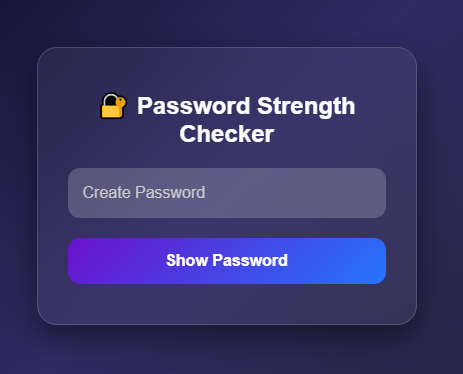
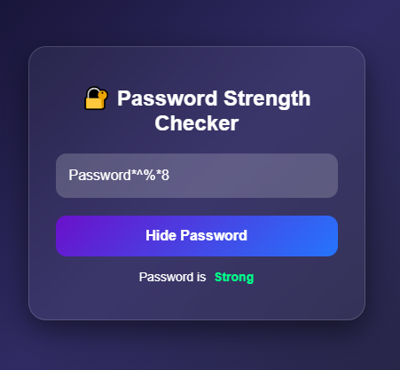

# 🔐 Password Strength Checker

This is a sleek and modern **Password Strength Checker** built using **HTML**, **CSS**, and **JavaScript**. It provides real-time feedback on the strength of a password based on its length, use of uppercase letters, and symbols.

---

## 🌟 Features

* ✅ Live password strength evaluation
* 👁️ Toggle password visibility
* 🎨 Glassmorphism UI design
* 💬 Strength indicators: Weak, Medium, Strong

---

## 🚀 How It Works

1. User enters a password.
2. JavaScript checks for:

   * Minimum length of 8 characters
   * At least one uppercase letter
   * At least one special character
3. Strength is displayed as:

   * **Weak**: less than 4 characters
   * **Medium**: meets some conditions
   * **Strong**: meets all conditions
4. "Show Password" button toggles password visibility.

---

## 🖼 Preview

  
  

## 🧠 Author Tips

* Extend strength logic by checking for numbers, lowercase letters, or common patterns.
* Add validation or suggestions for improving weak passwords.
* Integrate it into a sign-up form for a full app experience.

## 💡 Inspiration

Inspired by the need for better password hygiene and beautiful, responsive UI designs.
