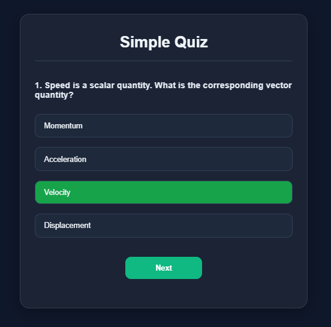
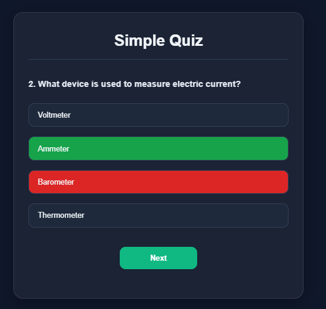

# Responsive JavaScript Quiz App

A simple, fully responsive and interactive quiz application built using **HTML**, **CSS**, and **JavaScript**. It features a modern UI and dynamic logic that gives immediate feedback to users after answering each question.

---

## 🚀 Features

- ✅ Multiple-choice questions
- ✅ Answer feedback (highlight correct and incorrect)
- ✅ Dynamic score tracking
- ✅ Responsive design (works on all devices)
- ✅ Smooth transitions and hover effects
- ✅ "Play Again" functionality

---

## 🖼 Preview

<div style="display: flex; gap: 15px; flex-wrap: wrap; justify-content: center; align-items: center;">
  
  
  
</div>


## 🛠 Tech Stack

- **HTML5** — structure
- **CSS3** — responsive and clean UI (flexbox, media queries)
- **Vanilla JavaScript** — interactive logic and state management

---

## 📂 File Structure

```
quiz-app/
├── index.html       # Main HTML file
├── style.css        # All styles (optional external file)
├── script.js        # All JS logic
└── README.md        # Documentation
```

## ✏️ Customizing Questions

Questions are defined in a JavaScript array. Example:

```js
const questions = [
  {
    question: "What is the capital of France?",
    answer: [
      { text: "Paris", correct: true },
      { text: "London", correct: false },
      ...
    ]
  },
  ...
];
```

You can easily add/remove questions by modifying this array in `script.js`.

---

## 🔮 Future Enhancements

- [ ] Save high scores using `localStorage`
- [ ] Add sound effects for correct/incorrect answers
- [ ] Add a progress bar
- [ ] Randomize questions on each attempt
- [ ] Add dark/light theme toggle

---


## 🙌 Acknowledgments

Built with ❤️ by [Ravi Ranjan Sharma | nr_snorlax](https://www.instagram.com/nr_snorlax/).

Feel free to fork this project and use it in your learning or portfolio!

