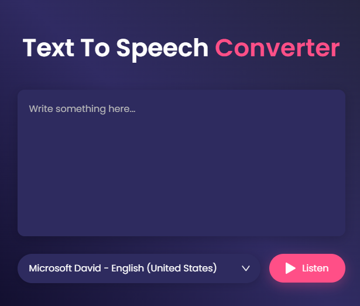

# Text to Speech Converter

A clean and interactive web application that converts written text into spoken voice using the Web Speech API. Users can input any text, select from available voices, and listen to the spoken output.

## 🚀 Features

* Simple and elegant user interface
* Custom voice selection from available system voices
* Responsive layout with modern design
* Easy-to-use text area with speech synthesis on button click

## 📁 File Structure

```
├── index.html           # Main HTML file
├── style.css            # Styling for the app
├── script.js            # JavaScript logic for speech synthesis
├── images/
│   ├── dropdown.png     # Dropdown arrow icon
│   └── play.png         # Play button icon
```

## 🧠 How It Works

1. User types text into the textarea.
2. User selects a voice from the dropdown menu.
3. On clicking the "Listen" button, the app uses the selected voice to read the text aloud.

The dropdown list of voices is populated dynamically using the `speechSynthesis.getVoices()` method and updates when voices change.

## 📸 Screenshots
<div style="display: flex; gap: 15px; flex-wrap: wrap; justify-content: center; align-items: center;">
  
</div>

## 💡 Notes

* Voice availability and language support depend on the browser and operating system.
* Works best in modern browsers like Chrome or Edge.

## 📌 To Do

* Add ability to pause/resume speech
* Allow control over pitch and rate
* Add support for saving favorite voices

