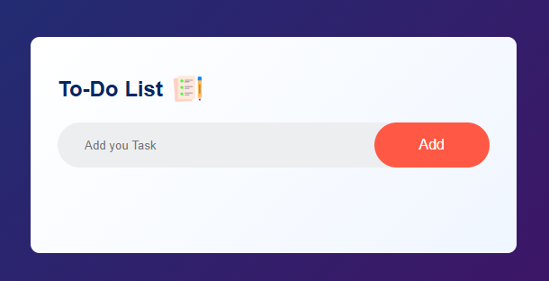
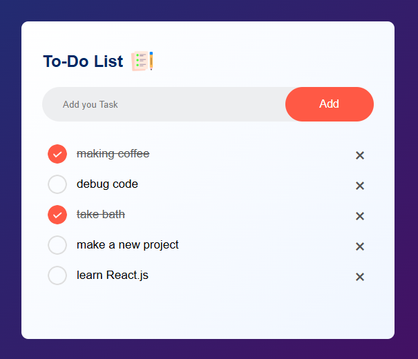
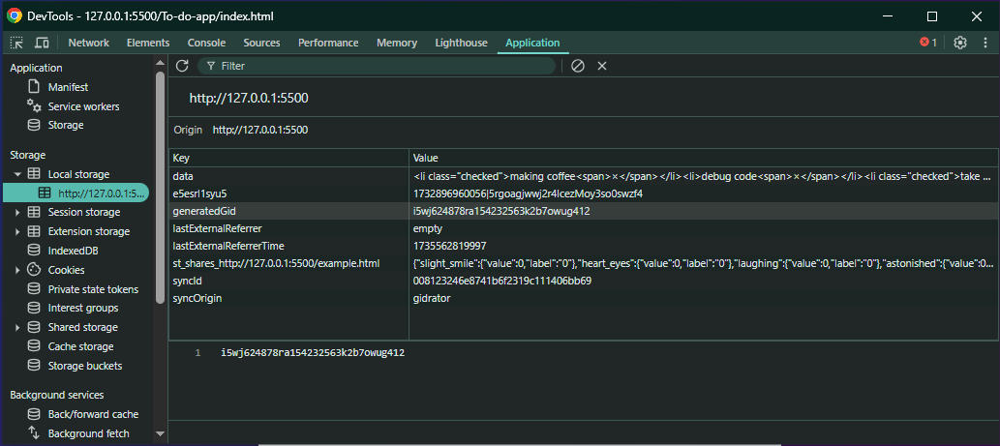

# 📝 To-Do List App

A simple, clean, and responsive To-Do List web application built using **HTML**, **CSS**, and **JavaScript**. This app lets users add, mark, and remove tasks with persistent data storage using **localStorage**.

## 🚀 Features

- Add new tasks to your list
- Mark tasks as completed
- Remove tasks with a single click
- Tasks are saved automatically in your browser's local storage

## 🖼 Preview 

  
  
  

---

