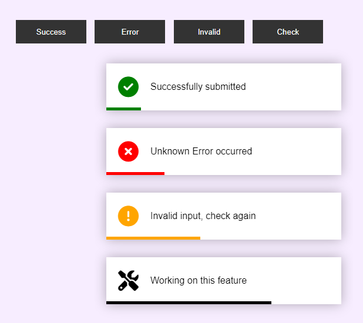

# Toast Notification Project

This is a simple and responsive Toast Notification system built using HTML, CSS, and JavaScript. It features four types of notifications: Success, Error, Invalid, and Working (in-progress), each with its own color scheme and animation.

## 🔥 Features

* Clean and modern UI
* Four types of notifications:

  * ✅ Success
  * ❌ Error
  * ⚠️ Invalid
  * 🛠️ Working
* Smooth entry animation
* Auto-dismiss after 6 seconds
* Responsive layout


## 🖼 Preview 

<div style="display: flex; gap: 15px; flex-wrap: wrap; justify-content: center; align-items: center;">
  

</div>


## 📁 Project Structure

```
├── index.html
```

All code is contained in a single HTML file for simplicity.

## 🚀 How It Works

* Clicking any of the four buttons triggers a specific toast message.
* Toasts slide in from the right and stack vertically.
* A color-coded progress bar below each toast counts down until it disappears.

## ✨ Customization

You can easily modify:

* The content of each toast message
* Toast colors by editing the corresponding classes (`.error`, `.invalid`, `.working`)
* Animation duration by adjusting the `animation` and `setTimeout` values

Enjoy building with toasts! 🍞
