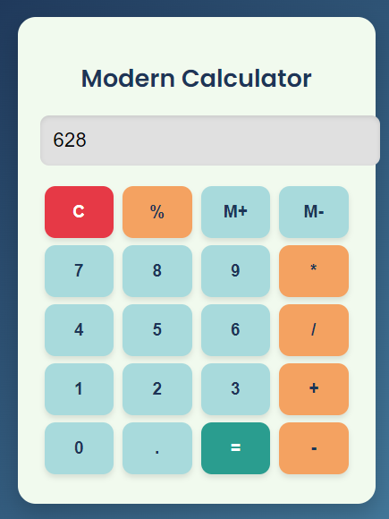

# Modern Calculator

A sleek, responsive, and user-friendly calculator built using HTML, CSS, and JavaScript.

## 🚀 Features

* Responsive and modern UI
* Basic arithmetic operations: `+`, `-`, `*`, `/`
* Percentage calculation (`%`)
* Memory operations (`M+` and `M-`)
* Clear button (`C`)
* Read-only input display to prevent direct editing
* Smooth button interactions with hover and click animations

## 🛠️ Built With

* **HTML5** for structuring the application
* **CSS3** with Google Fonts (Poppins) for styling
* **Vanilla JavaScript** for all interactive functionalities

## 💡 How It Works

* All input comes from button presses
* The current expression is stored as a string
* `eval()` is used to compute the result
* Memory operations (`M+` and `M-`) store and update a `memory` variable

## 🖼 Preview

  

## 🧠 Future Improvements

* Keyboard input support
* Dark/Light theme toggle
* Better error handling
* Separate memory recall button (`MR`)

---

Enjoy calculating with style! ✨
