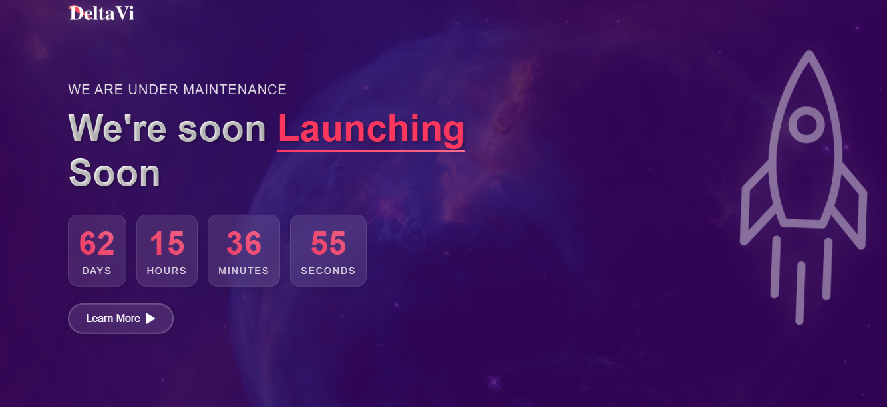

# Launch Page

A modern and responsive launch page with a countdown timer and animated rocket. This project features a sleek design with glassmorphism effects, smooth animations, and a professional look.

## Features

- 🚀 Animated rocket launch effect
- ⏰ Interactive countdown timer
- 🎨 Modern glassmorphism design
- 📱 Fully responsive layout
- ✨ Smooth animations and transitions
- 🌟 Gradient text effects
- 🎯 Clean and professional UI

## Preview



## Setup

1. Clone the repository
2. Open `index.html` in your browser
3. Customize the launch date in the JavaScript code
4. Replace images in the `images` folder with your own

## Customization

- Update the launch date in the JavaScript code:

```javascript
var countDownDate = new Date("July 10, 2025 00:00:00").getTime();
```

- Modify colors in the CSS to match your brand
- Replace images in the `images` folder:
  - `background.png` - Background image
  - `logo.png` - Your company logo
  - `rocket.png` - Rocket image
  - `triangle.png` - Button arrow icon

