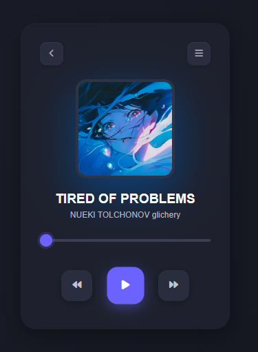
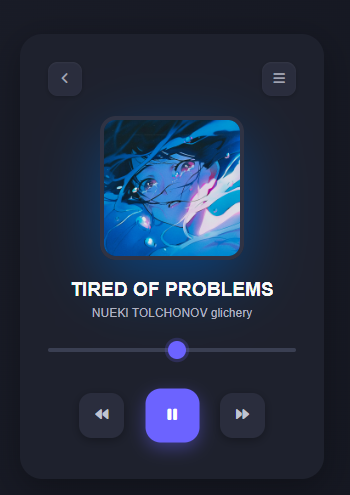

# Song Player Web App

A sleek and responsive song player web application built using HTML, CSS, and JavaScript. This player includes basic controls such as play, pause, forward, and backward, and features a custom progress bar with a clean, modern UI.

## 🖼 Preview

<div style="display: flex; gap: 15px; flex-wrap: wrap; justify-content: center; align-items: center;">
  
  
</div>
---

## Features

- Responsive and stylish design using modern CSS.
- Play/pause functionality with icon toggle.
- Real-time progress bar synced with audio.
- Custom styled audio slider.
- Hover effects for control buttons.

## Technologies Used

- HTML5
- CSS3
- JavaScript (ES6)
- Font Awesome (for icons)

## File Structure

```
project-folder/
├── index.html          # Main HTML structure
├── style.css           # Styling for the music player
├── script.js           # JavaScript logic for playback
├── media/
│   ├── img.jpg         # Album/song image
│   └── musics.mp3      # Music file
└── README.md           # Project documentation
```

## How to Use

1. Clone or download the project.
2. Place your own image in the `media` folder and update `img.jpg` if desired.
3. Replace `musics.mp3` with your own audio file (must be `.mp3`).
4. Open `index.html` in any modern browser to run the app.

## Customization

- Change the song and artist title by editing the `<h1>` and `<p>` tags in `index.html`.
- Update the styling in `style.css` to match your theme or brand.
- Add more functionality like playlist support or volume control by expanding `script.js`.

---

Enjoy building and customizing your own music player! 🎵
